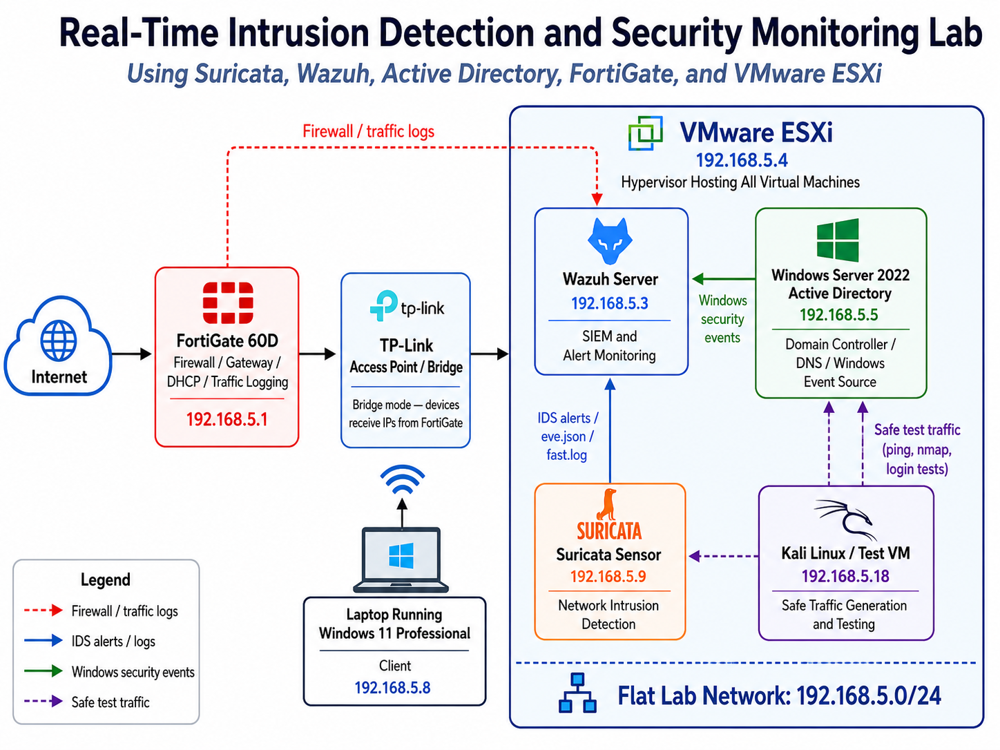
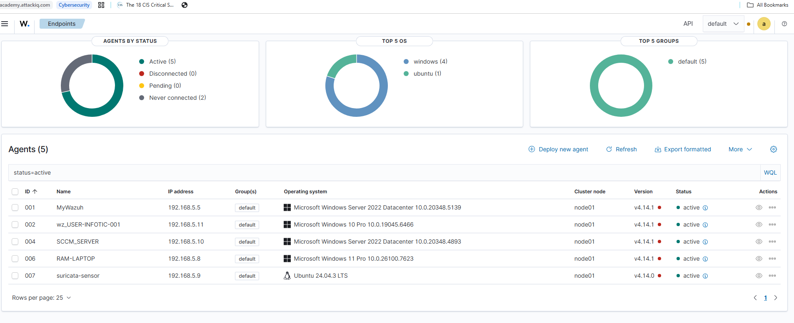
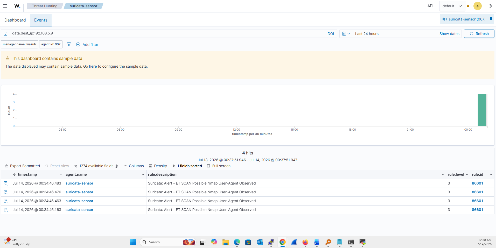
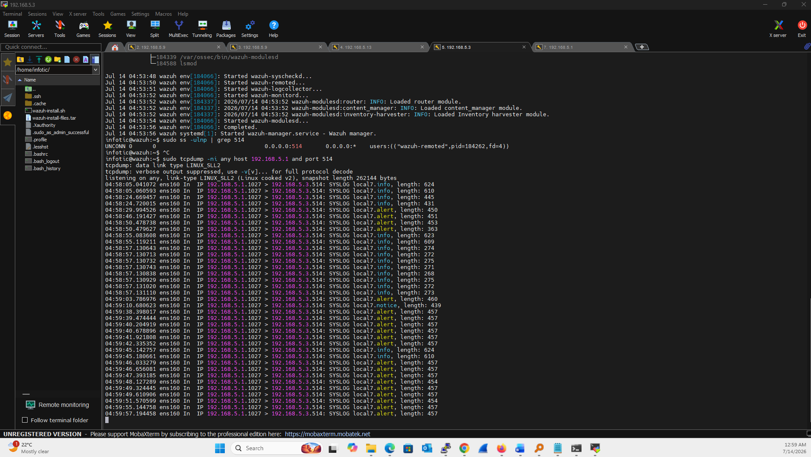
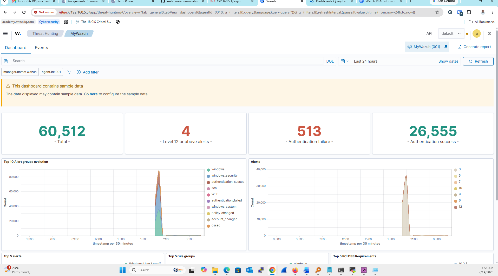

# Real-Time Intrusion Detection and Security Monitoring Lab

**Using Suricata, Wazuh, Active Directory, FortiGate, and VMware ESXi**

This repository contains an academic project demo for a real-time intrusion detection and security monitoring lab. The lab combines Suricata as a network intrusion detection sensor, Wazuh as the SIEM platform, Windows Server 2022 Active Directory as an authentication/event source, FortiGate 60D as the firewall/gateway, and VMware ESXi as the virtualization platform.

> This project is for educational and defensive security purposes only. All tests were performed in a controlled private lab environment.

## Academic Context

This project was prepared for the INCS 615 Advanced Network and Internet Security Term Project using **Option 2: Project Demo**. The submission includes this GitHub repository and a compact implementation report located in the `report/` folder.

## Lab Architecture



| Component | Role | IP Address |
|---|---|---:|
| FortiGate 60D | Firewall, gateway, DHCP, traffic logging | 192.168.5.1 |
| Wazuh Server | SIEM and alert monitoring | 192.168.5.3 |
| VMware ESXi | Hypervisor hosting all virtual machines | 192.168.5.4 |
| Windows Server 2022 Active Directory | Domain Controller, DNS, Windows event source | 192.168.5.5 |
| Laptop running Windows 11 Professional | Client endpoint | 192.168.5.8 |
| Suricata Sensor | Network intrusion detection | 192.168.5.9 |
| Kali Linux / Test VM | Safe traffic generation and testing | 192.168.5.18 |

## Objectives

- Deploy Suricata as a network intrusion detection sensor.
- Forward Suricata `eve.json` alerts to Wazuh using the Wazuh agent.
- Monitor Windows authentication events from Windows Server 2022.
- Prepare FortiGate syslog forwarding to the Wazuh manager.
- Generate safe test traffic from Kali Linux and validate detection in Wazuh.
- Document configuration, screenshots, and project results for academic review.

## Implementation Summary

The Wazuh agent was installed on the Suricata sensor and configured to monitor Suricata's JSON event log:

```xml
<localfile>
  <log_format>json</log_format>
  <location>/var/log/suricata/eve.json</location>
</localfile>
```

Kali Linux was used to generate safe test traffic toward the Suricata sensor. Suricata detected the traffic and generated an alert, which was forwarded to Wazuh and displayed in the Threat Hunting dashboard.

## Detection Scenarios

| Scenario | Source | Detection Tool | Result |
|---|---|---|---|
| Nmap scan detection | Kali Linux 192.168.5.18 | Suricata + Wazuh | Nmap alert displayed in Wazuh |
| Windows authentication monitoring | Windows Server 2022 AD | Wazuh agent | Authentication success/failure visible |
| FortiGate syslog forwarding | FortiGate 192.168.5.1 | Wazuh syslog listener | UDP/514 syslog traffic received |

## Key Evidence

### Wazuh Active Agents



### Suricata Nmap Alert in Wazuh



### Windows Authentication Events



### FortiGate Syslog Traffic to Wazuh



## Repository Structure

```text
real-time-ids-suricata-wazuh-ad-fortigate/
├── README.md
├── LICENSE
├── .gitignore
├── configs/
├── diagrams/
├── report/
├── scripts/
└── screenshots/
```

## Report

The final implementation report is available here:

- [`report/final-report.pdf`](report/final-report.pdf)
- [`report/final-report.docx`](report/final-report.docx)

## Notes and Limitations

- The lab uses a flat network: `192.168.5.0/24`.
- FortiGate is used as firewall, gateway, DHCP server, and syslog source.
- FortiGate does not appear as a Wazuh endpoint because it sends logs through syslog rather than a Wazuh agent.
- No real malware or unauthorized attacks were used.
- All traffic generation was limited to safe lab tests.
